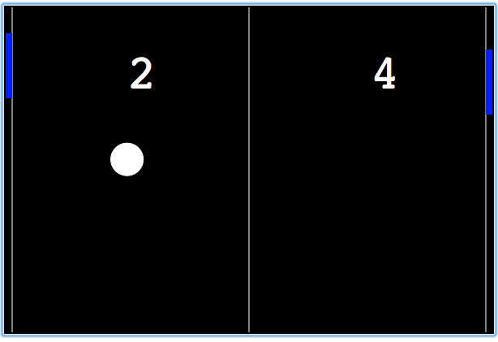

py-pong
============================

Simple implementation of classic arcade game Pong made in Python.
This was the Mini-project #4 for the course  "An Introduction to Interactive Programming in Python"
done in Coursera by Rice university

How To Get Started
==================

This Python implementation need to run on [codeskulptor.org](http://www.codeskulptor.org). 
- Copy the source of **py-pong**
- Paste the source inside [codeskulptor.org](http://www.codeskulptor.org)
- Press the play button.
- Enjoy :)

License 
---------
py-pong is available under the MIT license. See the LICENSE file for more info.

Follow me on twitter [@capezzbr](http://www.twitter.com/capezzbr)
---------
